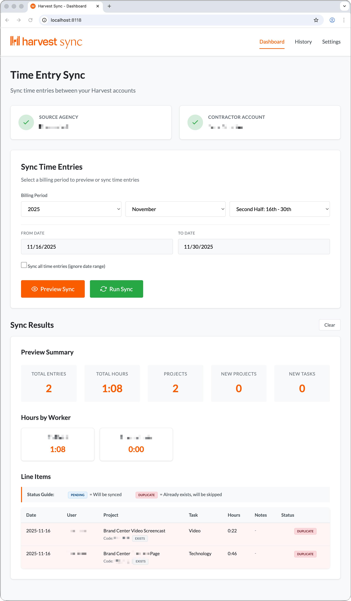

# Harvest Sync


This tool syncs time entries from one [Harvest](https://www.getharvest.com/) account (source agency) to another Harvest account (contractor company) for specified employees. Features a modern web dashboard with billing period selection, duplicate detection, and activity history.

>**Disclaimer:** This application is an independent, unofficial project and is not affiliated with, endorsed, or sponsored by Harvest. Harvest is a registered trademark of its respective owner.

## Documentation

- **[AI Agent Primer](AI_AGENT_PRIMER.md)** - Comprehensive project overview, architecture, and development guide for AI agents
- **[Harvest API v2 Reference](docs/harvest-api-v2.md)** - Complete Harvest API v2 documentation with endpoints, examples, and best practices

## Purpose

When contractors work for an agency but need to track their time in both the agency's Harvest account (for the agency's records) and their own company's Harvest account (for invoicing), this script automates the process of copying time entries between the two accounts.

## Setup

1. **Install dependencies:**

   ```bash
   npm install
   ```

2. **Configure environment variables:**

   Copy `.env.example` to `.env` and fill in your Harvest credentials:

   ```bash
   cp .env.example .env
   ```

   Then edit `.env` and add:
   - `AGENCY_HARVEST_TOKEN` - Personal Access Token for the source agency's Harvest account
   - `AGENCY_HARVEST_ACCOUNT_ID` - Source agency's Harvest Account ID
   - `CONTRACTOR_HARVEST_TOKEN` - Personal Access Token for your company's Harvest account
   - `CONTRACTOR_HARVEST_ACCOUNT_ID` - Your company's Harvest Account ID
   - `AGENCY_NAME` - Name of the source agency (for display purposes)
   - `CONTRACTOR_NAME` - Name of your company (for display purposes)
   - `EMPLOYEE_1_NAME` - Full name of first employee to sync (e.g., "John Doe")
   - `EMPLOYEE_2_NAME` - Full name of second employee to sync (optional)

### How to get Harvest credentials

1. **Personal Access Token and Account ID:**
   - Log into your [Harvest account](https://www.getharvest.com/)
   - Click on your profile picture in the top right corner
   - Select "Developers" from the dropdown menu
   - Click "Create New Personal Access Token"
   - Give it a name (e.g., "Harvest Sync Tool")
   - Copy both the **Token** and the **Account ID** that are displayed together on this page
   - **Important:** Both values are shown on the same page when you create the token

2. **Test your connection:**

   Before running the sync, test that your credentials are working:

   ```bash
   npm test
   ```

   This will verify that both Harvest accounts are accessible with the provided credentials.

## Usage

### Web Dashboard (Recommended)

The easiest way to use Harvest Sync is through the web dashboard:

```bash
npm start
```

This will:

- Start the web server on port 8118
- Automatically open your browser to <http://localhost:8118>
- Provide a visual interface for previewing and syncing time entries

**Dashboard Features:**

- **Multi-Page Navigation**: Dashboard, History, and Settings pages
- **Connection Status**: See if both Harvest accounts are connected
- **Billing Period Selection**: Choose Year, Month, and Half (Full Month, First Half 1st-15th, Second Half 16th-end)
- **Sync All Time Option**: Checkbox to sync all entries from 2000-01-01 to today
- **Preview with Duplicate Detection**: Shows accurate status (Pending vs Duplicate) before syncing
- **Hours by Worker**: Summary cards showing total hours per employee for selected period
- **Line Items Table**: Detailed view with project codes, task names, hours (hh:mm format), and status badges
- **Activity History**: Clickable history items to review past operations
- **Settings Page**: Configure API credentials, target users, and display preferences
- **Results Display**: See detailed summaries with Created vs Duplicate status

#### Screenshot



### Command Line Usage

You can also use the command line scripts directly:

#### Preview Mode (Recommended First Step)

Before syncing any data, use preview mode to generate an HTML report showing exactly what will be synced:

```bash
# Preview last 7 days (default)
npm run preview

# Preview specific date range
node syncAgencyToDestination-preview.js 2025-01-01 2025-01-31

# Preview a single day
node syncAgencyToDestination-preview.js 2025-01-15 2025-01-15
```

This will generate an HTML file (e.g., `sync-preview-2025-01-15T10-30-45.html`) that you can open in your browser. The report shows:

- Summary of total entries, hours, and projects
- Which projects will be created vs. already exist
- Which tasks are new
- All time entries grouped by user and project
- Detailed breakdown of what will happen when you run the actual sync

**Review the HTML report carefully before running the actual sync!**

### Sync time entries for a specific date range

```bash
node syncAgencyToDestination.js [FROM_DATE] [TO_DATE]
```

**Examples:**

```bash
# Sync last 7 days (default if no dates provided)
npm run sync

# Sync specific date range
node syncAgencyToDestination.js 2025-01-01 2025-01-31

# Sync a single day
node syncAgencyToDestination.js 2025-01-15 2025-01-15
```

Dates should be in `YYYY-MM-DD` format.

## What the tool does

### Preview Mode

1. **Fetches users** from both source and contractor Harvest accounts
2. **Identifies** the configured employees in both accounts
3. **Retrieves time entries** from the source agency for the specified date range
4. **Fetches existing entries** from contractor account for duplicate detection
5. **For each time entry:**
   - Checks if the project exists in the contractor account (matches by code if available, otherwise by name)
   - Checks if the task exists in the contractor account
   - Compares against existing contractor entries to detect duplicates
   - Marks as "Pending" (will be synced) or "Duplicate" (already exists)
6. **Returns detailed preview** with accurate status for each entry

### Sync Mode

1. **Fetches users** from both source and contractor Harvest accounts
2. **Identifies** the configured employees in both accounts
3. **Retrieves time entries** from the source agency for the specified date range
4. **For each time entry:**
   - Checks if the project exists in the contractor account
   - If not, creates the project
   - Ensures the task exists in the contractor account
   - Assigns the task to the project
   - Assigns the user to the project
   - Attempts to create the time entry in the contractor account
   - If entry already exists (422 error), marks as "Duplicate" and skips
   - Otherwise marks as "Created"
5. **Returns summary** with final status for each entry

## Important Notes

- The tool will **not** delete or modify existing time entries
- **Preview mode** checks for duplicates before syncing and shows accurate status
- **Sync mode** automatically skips duplicate entries (same user, project, task, date, hours, notes)
- Projects are matched by code if available, otherwise by name
- Projects are created with default settings (billable by project, no budget)
- Tasks are created as billable by default
- The tool processes only time entries for the employees configured in `.env`
- Time is displayed in hh:mm format (e.g., 1:08 for 1 hour 8 minutes)

## Troubleshooting

### "Harvest API error (401)"

- Check that your Personal Access Tokens are correct
- Make sure the tokens haven't expired

### "Harvest API error (403)"

- Your account may not have sufficient permissions
- You need Administrator or Manager access to create projects and time entries

### "User not found in contractor account"

- Make sure the configured employees exist in both Harvest accounts
- Check that their names match exactly (first name + last name) in both accounts

### Rate Limiting

- Harvest allows 100 requests per 15 seconds
- The script includes basic error handling but may need to be run again if rate limited
- Consider adding delays between requests if you encounter rate limiting

## Development

The main script is `syncAgencyToDestination.js`. Key functions:

- `harvestRequest()` - Makes authenticated requests to Harvest API
- `getAgencyTimeEntries()` - Fetches time entries from source agency
- `createContractorProject()` - Creates a new project in contractor account
- `ensureTaskExists()` - Creates a task if it doesn't exist
- `createContractorTimeEntry()` - Creates a time entry in contractor account
- `syncTimeEntries()` - Main orchestration function

The preview script is `syncAgencyToDestination-preview.js` which generates HTML reports without writing data.

### Styling Preview Reports

Preview report styles are managed using SCSS:

1. **Edit styles**: Modify `assets/styles/preview-report.scss`
2. **Compile CSS**: Run `npm run build:css` to compile SCSS to CSS
3. **Watch mode**: Run `npm run watch:css` for automatic compilation during development
4. **Generated files**: Compiled CSS is saved to `assets/styles/preview-report.css`

The preview script automatically loads the compiled CSS when generating HTML reports.
